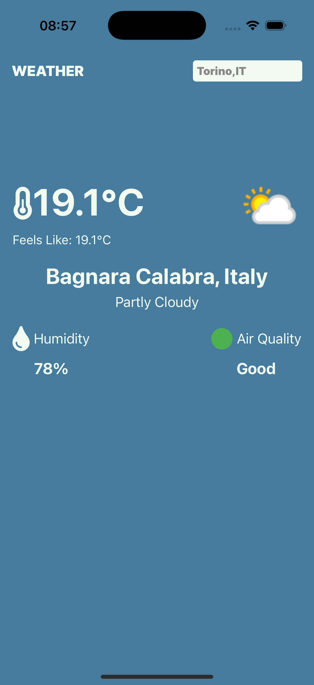

# Weather Finder 🌤️

A simple React Native app built with [Expo](https://expo.dev/) to find the current weather in any city using the [WeatherAPI.com](https://www.weatherapi.com/) API.

## 📸 Screenshot

## 🛠 Tech Stack

- React Native
- Expo
- WeatherAPI.com

## 📄 License

This project is licensed under the MIT License – see the [LICENSE](LICENSE) file for details.
